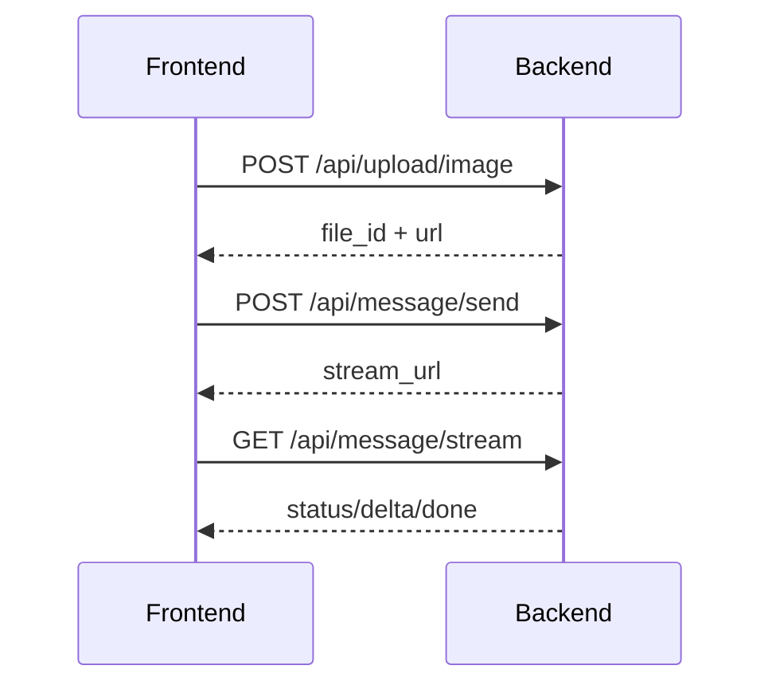

# AI 医生二期后端开发技术细节文档

## 1. 文档目标

本文档基于以下两部分信息整理：

- 二期产品文档：`/Users/mjm/Documents/FrontEnd/Project/小荷AI医生/ai-doctor/docs/PRD-v2.md`
- 当前后端代码：`NestJS + Prisma + PostgreSQL + LangChain`

目标不是重新设计一套全新后端，而是在现有代码基础上给出二期可执行的后端开发方案，确保后续开发能沿着同一条链路持续演进。

---

## 2. 当前后端基线

## 2.1 技术栈

- 框架：NestJS 10
- 数据访问：Prisma 5
- 数据库：PostgreSQL
- 大模型接入：`@langchain/openai`
- 输出协议：SSE

## 2.2 已有模块

当前 `src/app.module.ts` 已接入以下模块：

- `app-config`：下发免责声明、工具条、限制项
- `session`：创建/结束会话
- `message`：发送消息、SSE 流式输出
- `history`：历史会话列表、详情、删除
- `feedback`：点赞/点踩
- `share`：分享图 mock
- `health`：健康检查
- `storage`：Prisma Service + Repo 层

## 2.3 已有数据库模型

当前 `prisma/schema.prisma` 已有 3 张核心表：

### Session

- `session_id`
- `user_id`
- `title`
- `status`
- `started_at`
- `ended_at`
- `deleted_at`

### Message

- `message_id`
- `session_id`
- `role`
- `type`
- `content`
- `content_rich`
- `card`
- `attachments`
- `status`
- `feedback_status`
- `client_message_id`
- `created_at`
- `updated_at`
- `deleted_at`

### Feedback

- `feedback_id`
- `message_id`
- `action`
- `tags`
- `comment`
- `created_at`

## 2.4 已经跑通的主链路

当前消息链路已经具备二期最关键的基础能力：

1. `POST /api/message/send`
   - 校验文本
   - 创建 `user message`
   - 创建 `assistant placeholder`
   - 返回 `stream_url`
2. `GET /api/message/stream`
   - 拉最近消息上下文
   - 先跑 Policy
   - 再流式生成 Answer
   - 结束后更新 assistant message
   - 按策略插入 `download_app`、`intake_form`、`consult_summary`
3. `GET /api/history/detail`
   - 可以把文本消息和卡片消息一起取回

这意味着二期新增的“报告解读 / 拍患处 / 拍成分 / 拍药品 / 就医推荐”不应该另起一套独立问答系统，而应该继续复用现有 `message.send + message.stream + card message` 主链路。

---

## 3. 二期建设原则

## 3.1 只扩展主链路，不并行造轮子

PRD 已明确：“就医推荐与直接 AI 问答走同一条线路；如果有卡片则渲染卡片，否则直接输出普通回答。”  
因此二期后端应坚持：

- 文本问答、快捷入口、图片分析全部统一进入 `message` 主链路
- 结构化结果通过 `Message.type=card` 落库
- 图片只作为消息附件和模型上下文，不单独创造另一套“分析记录表 + 结果表 + 展示表”耦合前端

## 3.2 二期重点不是更多接口，而是更多任务类型

二期真正新增的是任务语义，而不是基础通讯协议：

- 一期任务：普通文本问答
- 二期任务：
  - `report_interpret`
  - `body_part`
  - `ingredient`
  - `drug`
  - `open_app`

其中“就医推荐”按前端文档口径，不作为独立任务类型存在，而是快捷入口 `doctor_reco` 触发普通文本 `帮我找医生`，继续走 `chat` 主链路。

后端需要做的是让同一套消息系统能识别并稳定执行这些任务。

## 3.3 允许先做单进程版，但接口与模型必须可扩展

当前服务可以先不引入 MQ/Redis/工作流引擎，但下面这些设计必须一次定对：

- 附件上传与消息发送解耦
- 流式任务可中断
- 图片分析任务有状态
- SSE 事件有明确协议
- 数据模型支持追溯任务来源和失败原因

---

## 4. 二期目标能力映射

## 4.1 PRD 能力与后端模块映射

| PRD 能力 | 后端落点 | 是否复用现有实现 |
| --- | --- | --- |
| 快捷入口条 | `app-config` 下发 tools + 前端触发标准消息 | 复用 |
| 就医推荐 | 快捷入口转普通文本消息，继续走 `message` 主链路 | 复用主链路 |
| 报告解读 | 新增附件上传 + 多模态模型接入 + `message` 主链路 | 部分新增 |
| 拍患处/拍成分/拍药品 | 同报告解读，换任务类型和 prompt | 部分新增 |
| 打开 App 引导 | `download_app` 卡片策略增强 | 复用并增强 |
| 咨询记录 | `history` | 复用 |
| 思考中 / 分析中状态 | SSE 状态事件 + message 状态扩展 | 新增 |
| 正在输出时点击新入口 | 中断当前流 + 启动新任务 | 新增 |

## 4.2 二期后端最小闭环

二期最低可交付版本必须覆盖：

1. 快捷入口触发标准任务
2. 图片上传并生成可访问附件
3. 图片任务进入同一条 `message` 流式回答链路
4. SSE 支持状态更新
5. 新任务触发时可以停止旧任务
6. 历史详情能回放文本、图片、卡片

---

## 5. 推荐的后端架构调整

## 5.1 模块划分

建议在当前模块基础上新增 2 个模块，并对 `message` 模块做多模态扩展：

### 1. `attachment`

负责图片上传生命周期：

- 获取上传凭证
- 上报上传完成
- 文件元数据校验
- 生成可供模型使用的访问 URL

### 2. `task`

负责“任务语义识别”和“并发控制”：

- 快捷入口标准化
- 当前会话是否有流式任务执行中
- 停止旧任务 / 标记中断
- 为 `message` 主链路补充任务上下文

## 5.2 保持现有 `message` 模块为总编排入口

不要把图片任务做成“上传后直接出结果”的另一套接口。推荐仍然由 `message` 模块编排：

1. 客户端上传图片
2. 客户端调用 `message/send`
3. `message/send` 根据 `task_context + attachment_ids` 创建消息对
4. `message/stream` 内部：
   - 统一调用支持多模态输入的大模型
   - 无图片时只传文本
   - 有图片时传文本 + 图片
   - `task_type` 仅决定 prompt 和回答策略

这样做的好处：

- 历史消息结构统一
- 前端渲染统一
- 卡片生成策略统一
- 后续增加更多任务不需要继续复制 Controller

---

## 6. 数据模型设计

## 6.1 保留现有三表，但必须扩展

当前三表不足以支撑二期图片任务和中断控制，建议做以下扩展。

## 6.2 Session 表扩展

建议新增字段：

- `entry_source String?`
  - `direct | tool_report | tool_doctor_reco | tool_body_part | tool_ingredient | tool_drug | history_continue`
- `last_message_at DateTime?`
- `active_task_id String?`

作用：

- 支持来源分析和埋点
- 支持历史排序
- 支持会话级并发控制

## 6.3 Message 表扩展

建议新增字段：

- `task_type String?`
  - `chat | report_interpret | body_part | ingredient | drug`
- `reply_to_message_id String?`
- `stream_status String?`
  - `pending | streaming | completed | interrupted | failed`
- `error_code String?`
- `error_message String?`
- `extra Json?`

说明：

- `status` 仍保留消息层状态：`sending | sent | failed | deleted | interrupted`
- `stream_status` 专门表达生成过程状态，避免混淆
- `task_type` 决定 prompt 和后置卡片策略
- `extra` 可记录分析张数、入口来源、模型名、耗时等运行信息

## 6.4 新增 Attachment 表

二期必须新增附件表，不建议把所有附件信息全塞进 `Message.attachments`。

建议模型：

```prisma
model Attachment {
  attachment_id   String   @id @default(uuid())
  user_id         String
  session_id      String?
  message_id      String?
  kind            String   // image
  biz_type        String   // report_interpret|body_part|ingredient|drug|chat
  file_name       String?
  mime_type       String
  size_bytes      Int
  width           Int?
  height          Int?
  storage_key     String
  public_url      String
  sha256          String?
  status          String   // pending|uploaded|ready|failed|deleted
  created_at      DateTime @default(now())
  updated_at      DateTime @updatedAt
  deleted_at      DateTime?

  @@index([session_id, created_at])
  @@index([message_id])
}
```

设计原则：

- `Message.attachments` 只保留前端渲染必要快照
- 真实生命周期和上传状态放在 `Attachment` 表
- 一条消息可关联多张图片

## 6.5 新增 TaskExecution 表

二期要支持“分析中 / 思考中 / 被中断 / 超时”，建议新增任务执行表。

```prisma
model TaskExecution {
  task_id          String   @id @default(uuid())
  session_id       String
  user_message_id  String
  assistant_message_id String
  task_type        String
  status           String   // queued|running|completed|failed|interrupted|timeout
  step             String?  // upload_ready|multimodal_generating|policy|answer_streaming|finalizing
  input_payload    Json?
  result_payload   Json?
  error_code       String?
  error_message    String?
  started_at       DateTime @default(now())
  finished_at      DateTime?

  @@index([session_id, started_at])
  @@index([assistant_message_id])
}
```

该表的意义：

- 给中断和超时一个真实归属对象
- 便于排查线上问题
- 便于后续迁移到异步队列

---

## 7. 核心接口设计

## 7.1 保留并升级现有接口

### `GET /api/app/config`

继续返回：

- `disclaimer`
- `tools`
- `limits`

建议二期追加：

- `tool_behaviors`
- `upload`
- `app_link`

示例：

```json
{
  "tools": [
    { "key": "report_interpret", "title": "报告解读", "icon": "report", "trigger_mode": "pick_image" },
    { "key": "doctor_reco", "title": "就医推荐", "icon": "pre_comment", "trigger_mode": "send_message", "preset_text": "帮我找医生" },
    { "key": "body_part", "title": "拍患处", "icon": "camera", "trigger_mode": "pick_image" },
    { "key": "ingredient", "title": "拍成分", "icon": "ingredients", "trigger_mode": "pick_image" },
    { "key": "drug", "title": "拍药品", "icon": "medicine", "trigger_mode": "pick_image" },
    { "key": "open_app", "title": "打开APP", "icon": "download1", "trigger_mode": "deeplink" },
    { "key": "history", "title": "咨询记录", "icon": "cc-history", "trigger_mode": "route" }
  ],
  "upload": {
    "image_max_mb": 10,
    "max_count": 9,
    "accept": ["image/jpeg", "image/png", "image/webp"]
  },
  "app_link": {
    "scheme_url": "xiaohe://upload?from=h5_ai_doctor",
    "download_url": "https://...",
    "app_store_url": "https://...",
    "yingyongbao_url": "https://..."
  }
}
```

### `POST /api/session/create`

请求体建议增加：

- `entry_source`
- `task_type`

用于记录用户第一次进入会话的来源。

### `POST /api/message/send`

按前端文档，二期消息发送协议应优先对齐为 `task_context + attachment_ids`：

```json
{
  "session_id": "sess_xxx",
  "client_message_id": "client_xxx",
  "content": "帮我解读这份报告",
  "task_context": {
    "task_type": "report_interpret",
    "entry": "quick_tool",
    "images": [
      {
        "file_id": "file_001",
        "url": "https://..."
      }
    ]
  },
  "attachment_ids": ["file_001"]
}
```

兼容原则：

1. 一期老字段可以短期兼容
2. 二期新增能力以 `task_context` 为准
3. `attachment_ids` 是后端查表和权限校验的主依据
4. `task_context.images` 主要用于前端状态恢复与调试展示

特殊说明：

- 纯文本任务不传 `attachment_ids`
- 图片任务必须带 `task_context.task_type`
- 就医推荐入口不传独立任务类型，直接发送普通文本消息：

```json
{
  "session_id": "sess_xxx",
  "client_message_id": "client_xxx",
  "content": "帮我找医生"
}
```

后端行为：

1. 校验文本或附件至少一个存在
2. 若无 `task_context.task_type`，则默认为 `chat`
3. 若是图片类任务，则必须校验 `attachment_ids`
4. 先检查会话是否有活跃任务
5. 根据并发策略决定中断或拒绝
6. 创建用户消息和 assistant 占位
7. 创建 `TaskExecution`
8. 返回 `stream_url`

### `POST /api/upload/image`

为了对齐前端 `uploadImage(file, biz)` 的使用方式，建议对外提供一个简化上传接口：

请求：

```json
{
  "file": "<binary>",
  "biz": "report_interpret"
}
```

响应：

```json
{
  "file_id": "file_001",
  "url": "https://...",
  "width": 1080,
  "height": 1440,
  "size": 123456
}
```

实现建议：

- 对外先暴露单接口，降低前后端联调复杂度
- 服务内部仍可拆为 `presign + complete`
- 若未来切直传对象存储，不改消息协议，只改上传实现

### `GET /api/message/stream`

二期继续保留 SSE，但事件建议扩展为四种：

- `status`
- `delta`
- `done`
- `error`

其中：

#### 1. `status`

用于前端展示：

- 正在分析 1 张图片
- 深度思考中
- 已完成思考
- 已停止生成

示例：

```text
event: status
data: {"message_id":"msg_xxx","task_id":"task_xxx","step":"multimodal_generating","text":"正在分析1张图片"}
```

该事件需要和前端 `MessageType="status"` 对齐，建议约定为：

- `status` 事件默认只做前端本地消息，不单独落库
- `done/error` 再回写真正需要持久化的 assistant message
- 如果后续需要历史回放“分析中/已停止生成”，再评估持久化 `status` 消息

#### 2. `delta`

保持现有协议不变：

```text
event: delta
data: {"message_id":"msg_xxx","text":"这是增量文本"}
```

#### 3. `done`

继续返回：

- `final`
- `cards`
- `task`

建议 `final` 额外补充可选字段以贴合前端类型：

- `task_type`
- `thinking_status`
- `fold_meta`
- `action_meta`

示例：

```text
event: done
data: {"final":{...},"cards":[...],"task":{"task_id":"task_xxx","status":"completed"}}
```

#### 4. `error`

建议统一：

```text
event: error
data: {"code":50002,"message":"multimodal timeout","task_id":"task_xxx"}
```

## 7.2 二期新增接口

### `POST /api/message/stop`

用于支持 PRD 中“正在输出时点击新入口，中断当前任务”。

请求：

```json
{
  "session_id": "sess_xxx",
  "assistant_message_id": "msg_xxx"
}
```

后端行为：

1. 找到会话内运行中的 `TaskExecution`
2. 触发流式中断
3. 更新：
   - `TaskExecution.status=interrupted`
   - `Message.stream_status=interrupted`
   - `Message.status=interrupted`
4. SSE 推送 `status=已停止生成`

### `GET /api/task/status`

调试和容灾用，可选实现。  
用于前端在 SSE 断开后补查任务状态。

---

## 8. 消息编排设计

## 8.1 编排总流程

二期推荐把 `MessageService.streamMessage` 拆成显式阶段：

1. `LoadTaskStage`
2. `PolicyStage`
3. `AnswerStage`
4. `CardStage`
5. `FinalizeStage`

## 8.2 LoadTaskStage

输入：

- 会话
- assistant message
- user message
- task_context
- attachment_ids

输出：

- 统一任务上下文 `TaskContext`

```ts
type TaskContext = {
  sessionId: string;
  userMessageId: string;
  assistantMessageId: string;
  taskId: string;
  taskType: string;
  userText: string;
  entry: "quick_tool" | "composer" | "history_retry";
  attachmentIds: string[];
  attachments: AttachmentDTO[];
  recentMessages: Array<{ role: string; content: string }>;
};
```

## 8.3 PolicyStage

保留现有 `LangChainService.runPolicySafe`，但输入要补充：

- `task_context.task_type`
- `has_attachments`
- `entry_source`

Policy 需要新增判断：

1. 是否需要追问卡
2. 是否需要下载 App 卡
3. 是否建议医生推荐
4. 是否结束当前咨询

建议 schema 扩展：

```ts
{
  need_intake_form: boolean,
  next_question?: string,
  intake_form?: {...},
  should_promote_download: boolean,
  should_recommend_doctor: boolean,
  closing_intent: "continue" | "end_by_user" | "end_by_model"
}
```

## 8.4 AnswerStage

Answer 模型的 prompt 需要按任务类型分流。

推荐策略：

- `chat`：普通医疗问答 prompt，也承接“帮我找医生”这类就医推荐入口
- `report_interpret`：报告解读 prompt
- `body_part`：患处观察 prompt
- `ingredient`：成分说明 prompt
- `drug`：药品说明 prompt

图片任务的关键点不是先单独做视觉解析，而是统一调用支持多模态输入的大模型；无图时只传文本，有图时传“文本 + 图片 URL”。

不要给每个任务独立写一个 service；应抽象成：

```ts
buildAnswerPrompt(taskType, baseInput, policy)
```

建议执行逻辑：

1. 始终走同一个大模型调用入口
2. 若 `attachmentIds.length === 0`，仅传文本输入
3. 若 `attachmentIds.length > 0`，传文本 + 图片输入
4. 两类输入都输出统一的流式文本
5. 完成后统一进入 `CardStage`

## 8.5 CardStage

当前已有：

- `download_app`
- `intake_form`
- `consult_summary`
- `open_app_upsell`

二期建议新增但不强制首版落库的卡片：

- `image_retry_guide`

但按 PRD 和前端当前口径，首版可以先不引入医生专属 card_type，只要普通文本能承接即可。  
因此首版建议：

- 就医推荐先返回 Markdown 文本
- 追问继续复用 `intake_form`
- 下载引导复用 `download_app`
- “上传更多资料”强转化场景使用 `open_app_upsell`

## 8.6 FinalizeStage

执行：

1. 更新 assistant text
2. 更新 `TaskExecution`
3. 插入卡片消息
4. 返回 SSE done

如果中途报错：

1. assistant message 设为 `failed`
2. `TaskExecution.status=failed`
3. 发送 `error`

---

## 9. 各任务类型的后端实现细节

## 9.1 就医推荐

### 触发

- 快捷入口点击后前端直接发：
  - `content="帮我找医生"`

### 后端处理

1. 不需要附件
2. 不创建独立任务类型，按 `chat` 处理
3. Policy 判断是否需要继续追问疾病类型
4. Answer Prompt 要求输出：
   - 建议科室
   - 推荐医生列表或选择建议
   - 适用场景
   - 风险提示

### 首版建议

- 先以 Markdown 结构返回
- 不新增医生专属卡片协议

## 9.2 报告解读

### 触发

- 先上传图片
- 再发送消息：
  - `task_type="report_interpret"`
  - `content` 可为空，后端默认补成 `请帮我解读这份报告`
  - `attachment_ids=["file_xxx"]`

### 后端处理

1. 校验至少 1 张图片已 `ready`
2. 先发送 `status=正在分析X张图片`
3. 统一调用支持多模态输入的大模型，并传入文本 + 图片
4. Answer 模型输出：
   - 总结结论
   - 关键指标说明
   - 异常风险提示
   - 建议下一步
5. Policy 决定是否需要追问症状和是否展示下载卡

### 异常降级

- 看不清：直接返回重拍建议
- 模型超时：输出通用兜底文案 + 重试提示

## 9.3 拍患处

### 触发

- `task_type="body_part"`

### 回答目标

- 初步观察描述
- 可能原因范围
- 哪些情况需要尽快线下就医
- 追问部位、时长、疼痒程度、是否破损

### 风险边界

- 不允许给确诊结论
- 遇到高风险内容必须加线下就医建议

## 9.4 拍成分

### 触发

- `task_type="ingredient"`

### 回答目标

- 识别成分名称
- 解释主要用途或风险
- 提示过敏、禁忌、特殊人群风险

## 9.5 拍药品

### 触发

- `task_type="drug"`

### 回答目标

- 识别药品名称
- 说明常见用途
- 用法用量风险提示
- 孕妇/儿童/老人/过敏人群风险提醒

---

## 10. 并发、中断与状态机

## 10.1 服务端状态机

建议统一为：

- `idle`
- `uploading_image`
- `multimodal_generating`
- `policy_running`
- `answer_streaming`
- `finalizing`
- `completed`
- `failed`
- `interrupted`
- `timeout`

## 10.2 会话内单活跃任务原则

同一 `session` 同一时刻只允许一个运行中的 `TaskExecution`。

推荐规则：

1. 用户点击快捷入口时优先级最高
2. 若当前有活跃任务：
   - 默认中断旧任务
   - 再启动新任务
3. 如果旧任务已进入 finalize，则新任务等待或直接启动新会话

## 10.3 中断实现建议

单机版可先用内存注册表：

```ts
Map<taskId, AbortController>
```

但必须满足：

- DB 中也记录任务状态
- SSE 关闭时同步触发中断
- 后续迁移 Redis 时不改接口

## 10.4 前后端协作约定

当前端点击新快捷入口时：

1. 先调用 `POST /api/message/stop`
2. 收到成功后再发新的 `message/send`

如果前端不调用 stop，后端在 `message/send` 里也必须兜底检查活跃任务并自动中断。

---

## 11. 图片上传与附件流转

## 11.1 推荐时序



如果后端内部采用对象存储直传，可以在服务内部拆为 `presign + complete` 两阶段，但对前端仍建议先保持单接口 `upload/image`，保证联调口径简单稳定。

## 11.2 为什么不要直接 base64 传图

- 请求体过大
- 无法复用上传状态
- 无法重试
- 历史回放困难
- 影响流式链路稳定性

## 11.3 上传校验

必须校验：

- 文件类型
- 文件大小
- 图片张数
- 是否上传完成
- 当前用户是否有权限使用该附件

建议限制：

- 单张最大 10MB
- 单次最多 9 张
- 只接受 `jpg/png/webp`

---

## 12. Prompt 与模型策略

## 12.1 模型分层

建议采用统一模型职责：

- `policyModel`
  - 结构化判断
  - 温度低
- `llmModel`
  - 统一使用支持多模态输入的大模型
  - 无图时只传文本
  - 有图时传文本 + 图片
  - 支持流式

## 12.2 Prompt 输入结构

Answer Prompt 不应只吃 `user_text`，应统一输入：

```ts
{
  task_type,
  user_text,
  recent_messages,
  image_urls,
  need_intake_form,
  intake_question,
  disclaimer
}
```

## 12.3 Prompt 输出约束

二期建议统一约束：

- 不做医疗诊断
- 不承诺治愈
- 遇到高风险情况给出立即就医建议
- 报告/药品/图片识别不确定时明确说明“不确定”
- 有图任务优先依据图片和用户文本联合回答，不单独暴露“视觉中间结论”

## 12.4 下载卡策略

`download_app` 不应只根据文本长度触发。建议改为多因子判断：

- 图片任务默认更高概率触发
- 多轮问答更高概率触发
- 需要上传更多资料时强触发
- 用户明确结束问答时不再强推

---

## 13. 错误码与异常处理

## 13.1 建议统一业务码

| 业务码 | 含义 |
| --- | --- |
| `40001` | 文本为空且无附件 |
| `40002` | 文本超长 |
| `40003` | 图片格式非法 |
| `40004` | 图片数量超限 |
| `40005` | 附件未就绪 |
| `40401` | 会话不存在 |
| `40402` | 消息不存在 |
| `40403` | 附件不存在 |
| `40901` | 幂等冲突 |
| `40902` | 会话已有运行中任务 |
| `42901` | 发送过于频繁 |
| `50001` | LLM 服务异常 |
| `50002` | 任务超时 |
| `50003` | 视觉分析失败 |
| `50004` | SSE 中断异常 |

## 13.2 典型异常处理

### 图片上传失败

- 附件状态置 `failed`
- 前端允许重试或删除

### 图片不可识别

- 不直接报 500
- 返回普通 assistant 文本，提示用户重新拍摄

### SSE 断开

- 若任务仍在运行，服务端继续执行到超时或完成
- 前端可通过 `task/status` 轮询兜底

### 新任务抢占旧任务

- 旧任务记为 `interrupted`
- assistant 文本保留已生成部分
- done 不再发卡片

---

## 14. Repo 层重构建议

## 14.1 当前 Repo 现状

当前 `MessageRepo` 和 `SessionRepo` 已能支撑一期，但二期建议补齐以下能力：

### MessageRepo 新增方法

- `getById`
- `listAttachmentsByMessageId`
- `updateStreamStatus`
- `appendExtra`
- `findRunningAssistantBySessionId`

### SessionRepo 新增方法

- `updateLastMessageAt`
- `setActiveTask`
- `clearActiveTask`

### AttachmentRepo

- `createPendingAttachment`
- `markUploaded`
- `markReady`
- `bindToMessage`
- `findReadyByIds`

### TaskRepo

- `createTask`
- `markRunning`
- `markCompleted`
- `markFailed`
- `markInterrupted`
- `findRunningBySessionId`

## 14.2 Service 层拆分建议

建议把当前偏重的 `MessageService` 拆成：

- `MessageCommandService`
- `MessageStreamService`
- `TaskOrchestratorService`
- `PromptBuilderService`
- `MultiModalService`

这样可以避免二期所有复杂逻辑继续堆在一个文件里。

---

## 15. 历史记录与回放要求

## 15.1 历史详情必须能重建 UI

因此 `history/detail` 返回的消息对象至少需要让前端知道：

- 角色
- 类型
- 文本内容
- 图片附件
- 卡片内容
- 运行结果状态

建议返回字段补充：

- `task_type`
- `stream_status`
- `thinking_status`
- `error_code`
- `error_message`

## 15.2 对欢迎消息的处理

当前欢迎消息未落库，只由 `session/create` 直接返回。  
二期如果希望历史里也能看到欢迎语，建议二选一：

1. 创建会话时同步落库 welcome message
2. 历史详情阶段按规则动态补回

推荐方案：直接落库，逻辑最简单。

---

## 16. 安全、审计与观测

## 16.1 必须记录的日志

- `session_id`
- `task_id`
- `message_id`
- `task_type`
- 模型名
- multimodal 耗时
- policy 耗时
- answer 耗时
- 总耗时
- 错误码

## 16.2 敏感信息处理

- 日志不要直接打印完整报告图片 URL
- 不要在日志里打印完整用户病史文本
- 可以做脱敏截断

## 16.3 指标建议

- 消息发送成功率
- SSE 完成率
- 图片识别成功率
- 任务平均耗时
- 下载卡触发率
- 追问卡触发率
- 中断率

---

## 17. 测试方案

## 17.1 单元测试

重点覆盖：

- `message/send` 参数校验
- 幂等逻辑
- task_type 路由
- policy 解析失败兜底
- 下载卡触发策略
- 中断逻辑

## 17.2 集成测试

需要覆盖：

1. 普通文本问答
2. 就医推荐快捷入口
3. 报告解读上传 1 张图
4. 图片识别失败
5. 正在流式输出时触发新任务
6. 历史详情回放含 card + image

## 17.3 联调验收清单

最少人工验收以下场景：

1. 点击“就医推荐”直接出回复
2. 点击“报告解读”上传图片后能看到“正在分析1张图片”
3. 分析完成后返回文本与追问卡
4. 适当场景出现“打开 APP 上传更多资料”
5. 正在输出时点新入口，旧回答停止
6. 进入咨询记录后能看到完整历史

---

## 18. 小步开发计划

## 第一步：补协议与类型骨架

- 固定 `task_context + attachment_ids` 入参
- 固定 `TaskType`、`MessageStatus`、`MessageType`
- 统一 `status / delta / done / error` SSE 事件结构

交付物：

- controller DTO
- 类型定义
- 文档与代码口径一致

## 第二步：实现图片上传接口

- 新增 `Attachment`
- 实现 `POST /api/upload/image`
- 完成文件类型、大小、数量校验

交付物：

- 返回 `file_id / url / width / height / size`

## 第三步：扩展消息发送协议

- `message/send` 支持 `task_context + attachment_ids`
- 校验附件归属与状态
- 创建 user/assistant message 和 `TaskExecution`

交付物：

- 文本任务和图片任务都能返回 `stream_url`

## 第四步：接入统一多模态大模型主链路

- 图片任务不再走“先视觉分析再回答”的两阶段编排
- 在 `message/stream` 中统一调用一个支持多模态输入的大模型
- 无图时只传文本，有图时传文本 + 图片
- 按 `report_interpret / body_part / ingredient / drug` 分流 prompt

交付物：

- 4 类图片任务都能稳定返回有效文本结果

验收：

- 上传图片后能收到稳定回复，不再只是普通文本兜底

## 第五步：补 `status` 事件

- 支持：
  - `正在分析X张图片`
  - `深度思考中`
  - `已完成思考`
  - `已停止生成`

交付物：

- 前端可渲染 `assistant + type=status`

## 第六步：实现中断与并发控制

- 增加 `message/stop`
- 会话内仅允许单个运行中任务
- 新任务可中断旧任务

交付物：

- 旧任务可停止并标记 `interrupted`

## 第七步：补卡片策略

- 在多模态回答完成后继续生成：
  - `intake_form`
  - `download_app`
  - `open_app_upsell`

交付物：

- 图片任务可在回答后继续追问和引导打开 App

## 第八步：补历史回放与收尾

- `history/detail` 补齐 text/image/card 所需字段
- 保证图片任务历史可完整重建

交付物：

- 从新建会话到图片任务、追问卡、App 引导、历史查看形成完整闭环

---

## 19. 与现有代码的差距总结

当前代码已经具备：

- 会话与历史骨架
- SSE 流式文本输出
- policy + answer + card 的基本编排
- 卡片作为独立 message 落库的设计

当前代码尚缺：

- 附件上传完整链路
- 图片任务模型与状态
- 任务执行记录
- 流式中断接口
- 图片/任务类型专用 prompt
- 更细粒度的 SSE 状态事件
- `open_app_upsell` 卡片
- 欢迎消息落库

因此二期最合理的实施方式不是重写，而是围绕 `message` 主链路补“附件、任务、视觉、中断”四块能力。

---

## 20. 最终结论

二期后端应采用“统一消息主链路 + 图片附件前置上传 + 任务语义扩展 + SSE 状态增强”的方案。

核心落地原则只有三条：

1. 所有任务最终都回到 `message/send + message/stream`
2. 所有结构化结果仍然以 `Message(type=card)` 落库
3. 所有图片分析与并发控制都围绕 `Attachment + TaskExecution` 扩展

只要按这条路线推进，二期功能既能快速落地，也不会破坏现有一期代码的可维护性。
